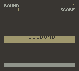

# Stratagem Hero

A Game Boy Color ROM I've been working on occasionally. It started out of curiosity, but once I got familiar enough with the hardware I decided to reproduce the arcade game Stratagem Hero from Helldivers 2.

I've been busy, so it's not done. You can run it, but it's just static background tiles. In the meantime, check out Despa Development's GBC de-make of the [same game](https://despa-dev.itch.io/stratagem-hero-de-make). I couldn't believe someone had already done it. I had no idea people were still making ROMs.
